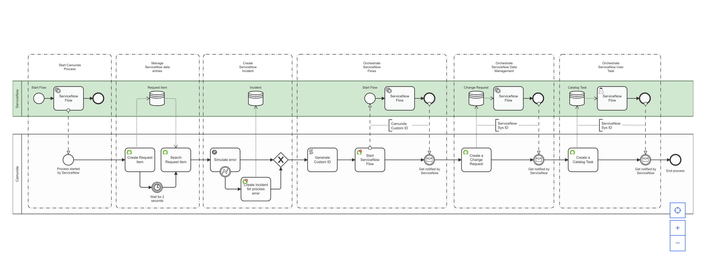
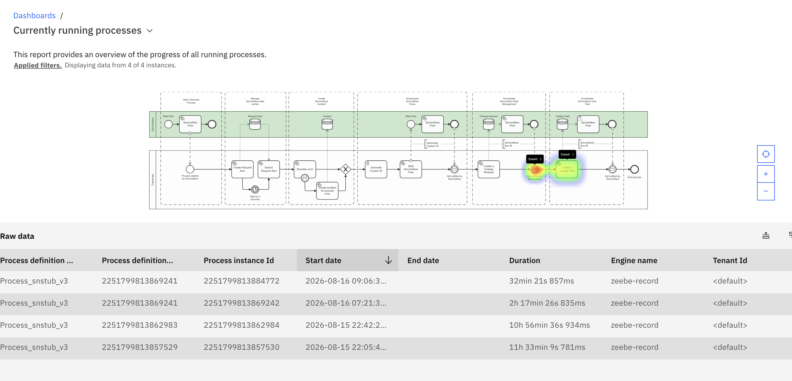
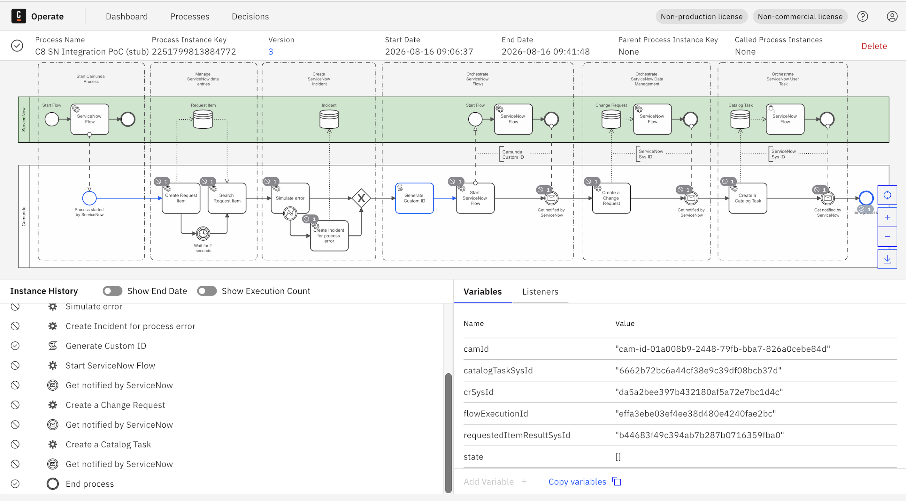

# Camunda–ServiceNow Integration, Stubbed

Runs Camunda's [ServiceNow Integration Quick Start](https://marketplace.camunda.com/en-US/apps/632605/servicenow-integration-quick-start)
blueprint end-to-end on a **self-managed Camunda 8.8** stack — with no ServiceNow
instance, no ServiceNow Store entitlement, and no IntegrationHub Enterprise Pack.

A Python FastAPI service stands in for ServiceNow. Every outbound call the blueprint
makes is a real HTTP request; every callback into Camunda is a real message
publication against the Orchestration Cluster REST API. What is removed is the
procurement, not the integration.



---

## Why stub ServiceNow at all?

The blueprint is bi-directional. Camunda calls ServiceNow, and ServiceNow calls
Camunda back. The outbound half needs nothing special. The return half is where the
blueprint stops being self-service.

### What a "spoke" is

ServiceNow's integration layer is **IntegrationHub**, built on a hub-and-spoke model.
The *hub* is the engine inside Flow Designer that executes integration steps. A
*spoke* is a packaged scoped application containing pre-built Actions for one external
system, surfaced as drag-and-drop steps in Flow Designer.

Spokes are named after the system at the far end, not after who wrote them. The
**Camunda Spoke** is therefore ServiceNow code, running inside ServiceNow, authored by
Camunda as a ServiceNow build partner and distributed through the ServiceNow Store.
Its scope namespace is visible in the setup instructions as `x_camun_camunda.Camunda` —
`x_` for custom scoped app, `camun` for the vendor prefix.

It provides four Flow Designer actions pointing at a Camunda cluster: **Start process**,
**Correlate message**, **Send signal**, **Cancel process**.

### Gate 1 — Store entitlement

A ServiceNow **Personal Developer Instance** is free, and satisfies two prerequisites
outright: it is a full instance on the current release (Yokohama or newer), with an
admin account able to reach target tables and Flow Designer.

What a PDI does **not** have is Store entitlement. The setup instructions say to open
Application Manager, search for Camunda Spoke, and install it — but that only works if
the app is already entitled to the instance. Store apps are requested through an HI
account tied to a customer or partner company, and then appear in Application Manager
on that company's instances. A PDI has no company behind it, so the search returns
nothing and there is no self-service path around it.

### Gate 2 — Enterprise Pack

The blueprint's `Start ServiceNow Flow` task uses the **Flow Starter** connector, which
additionally requires **IntegrationHub Enterprise Pack** and **Flow Trigger – REST**.
The Enterprise Pack Installer is not available on a PDI. That is a licensed SKU, not a
plugin you activate.

The **Starter Pack** and **Action Step – REST** *are* PDI-activatable via the
IntegrationHub Installer — and those are what a Flow would need to call back into
Camunda. So the plugin list gates the *inbound* direction; it does not gate the Table
API calls at all.

### Gate 3 — reachability

A PDI lives in ServiceNow's cloud. A Docker Compose stack lives on a laptop. Nothing
in ServiceNow can reach `localhost:8080`. Closing that loop needs a public tunnel
(cloudflared/ngrok) fronting the orchestration cluster, or a MID Server. In practice
this costs more time than the plugins do.

### Gate 4 — the Spoke assumes SaaS

Even with the Spoke installed, its configuration is shaped for Camunda 8 SaaS. The
OAuth profile wants token URL `https://login.cloud.camunda.io/oauth/token`; the
connection record wants Host set to a cluster **Region ID** (e.g. `lhr-1.zeebe.camunda.io`)
and Base path set to a **Cluster ID**. Credentials come from the SaaS Console's API tab.

None of that exists in a self-managed stack. There is no Console API tab, no region ID,
no cluster ID. You would repoint the token URL at Keycloak, register a client with the
IdP, and grant it authorizations in Orchestration Cluster Admin — plus read and possibly
patch the `OAuthCamundaUtil` script include, which handles Camunda-specific token
mechanics and most likely injects the SaaS `audience` parameter.

This is precisely the *"may require minor adjustments to the Camunda Spoke"* caveat on
Camunda's [prerequisites page](https://docs.camunda.io/docs/components/camunda-integrations/servicenow/prerequisites/).
It is unsupported territory.


---

## Connectors

All three ServiceNow connectors and the generic REST connector compile to the **same
job type**. Verified from Camunda's own element-template JSON, included in
`Connectores/`:

| Template | ID | Job type |
|---|---|---|
| ServiceNow Outbound Connector | `io.camunda.connectors.ServiceNow.v1` | `io.camunda:http-json:1` |
| ServiceNow Incident Handler | `io.camunda.connectors.ServiceNowIncident.v1` | `io.camunda:http-json:1` |
| ServiceNow Flow Starter | `io.camunda.connectors.ServiceNowFlow.v1` | `io.camunda:http-json:1` |
| REST Outbound Connector | `io.camunda.connectors.HttpJson.v2` | `io.camunda:http-json:1` |

There is no ServiceNow worker at runtime. The certified ServiceNow connectors are the
generic HTTP connector with a ServiceNow-shaped properties panel over the top — table
dropdowns, a `sysparm_query` field, a pre-built URL expression. That is why this model
runs unchanged with the templates removed.

### Template version drift

The published blueprint references template versions that are not the ones currently on
the Marketplace — in **both** directions:

| Task | Template | Blueprint wants | Marketplace ships |
|---|---|---|---|
| Create / Search Request Item, Change Request, Catalog Task | `ServiceNow.v1` | **7** | 3 |
| Start ServiceNow Flow | `ServiceNowFlow.v1` | **3** | 1 |
| Create Incident | `ServiceNowIncident.v1` | **2** | 3 |
| Simulate error | `HttpJson.v2` | **11** | 13 |

Because the drift runs both ways, no single download resolves it — Modeler needs an
exact id+version match and flags every task as *Template not found*. The REST connector
is worse: v13 declares `"engines": {"camunda": "^8.9"}`, which excludes an 8.8 cluster
outright.

**What was changed:** the `zeebe:modelerTemplate`, `zeebe:modelerTemplateVersion` and
`zeebe:modelerTemplateIcon` attributes were stripped from all seven service tasks, along
with the two dangling `elementTemplateId` / `elementTemplateVersion` task headers. Every
`taskDefinition`, input mapping, secret reference and result expression is untouched.
The tasks render as plain service tasks and behave identically — the model deployed and
ran green with the templates unresolved, which is the clearest possible demonstration
that they are editor metadata.

`Connectores/` holds the four templates as downloaded from the Marketplace, unmodified.
They are here as evidence for the table above: each file's `id`, `version` and `engines`
fields are what a reader can check against the blueprint's `zeebe:modelerTemplateVersion`
attributes. None of them are required to run the model.

---

## What the stub implements

`app.py` plays the ServiceNow pool. Note that the ServiceNow lane in the diagram — the
green band — is `isExecutable="false"`. Its tasks, events and data stores have zero
runtime behaviour; they are documentation. On a real instance those boxes are Flow
Designer work you still have to build. Here, the stub is that implementation.

```
POST   /api/now/table/{table}            Table API create   -> {"result": {"sys_id": ...}}
GET    /api/now/table/{table}            Table API read     -> {"result": [...]}
PATCH  /api/now/table/{table}/{sys_id}   Table API update
DELETE /api/now/table/{table}/{sys_id}   Table API delete
POST   /api/camun/{flow}                 Flow Trigger stand-in -> {"result": {"executionId": ...}}
GET    /simulate-error/{code}            deterministic HTTP error for the error branch

POST   /sim/complete/{sys_id}            play the agent: close the record, publish the message
GET    /sim/records                      inspect everything created so far
GET    /health                           readiness + OIDC status
```

Inbound calls are Basic-authenticated against `SN_USER` / `SN_PWD`, so the
`{{secrets.snUser}}` / `{{secrets.snPwd}}` path in the model is genuinely exercised.
Outbound callbacks authenticate to Camunda with OIDC client credentials.



**A correlation fix worth carrying forward.** The Spoke's *Correlate message* action maps
to the correlate-message endpoint, which is explicitly **not buffered**. The blueprint
puts `Start ServiceNow Flow` immediately before a catch on `fromSN`, so a fast callback
can arrive before the token does and be dropped silently. This stub uses the **buffered
publication** endpoint with a TTL instead. That is a fix, not a workaround — carry it
into any real ServiceNow flow you build.

---

## Cutting over to a real instance

The model carries one indirection so the switch is a single field:

```
snInstance = "stub"
snBaseUrl  = if snInstance = "stub"        then "http://host.docker.internal:8001"
        else if snInstance = "stub-docker" then "http://sn-stub:8000"
        else "https://" + snInstance + ".service-now.com"
```

Set `snInstance` to a real instance name and every Table API task retargets. Then:

1. Point the connector secrets at the real ServiceNow account.
2. Expose the cluster to ServiceNow (cloudflared/ngrok, or a MID Server).
3. Rebuild the callbacks as Flow Designer flows with Action Step – REST, replicating what
   `app.py` does: publish `fromSN`, `changeRequestDone`, `catalogTaskDone`.
4. Revert `Simulate error` if you no longer want a forced failure.

`Start ServiceNow Flow` stays synthetic without the Enterprise Pack. On a PDI, back it
with a Scripted REST API at the same path — the connector never learns the difference.

---

## Verified end-to-end



All five regions of the blueprint, three message correlations on three distinct keys, and
the error boundary firing on a real 407 — on a self-managed cluster with OIDC enforced,
zero ServiceNow entitlement, and zero Enterprise Pack.
